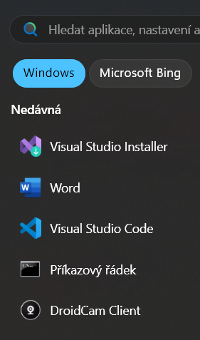
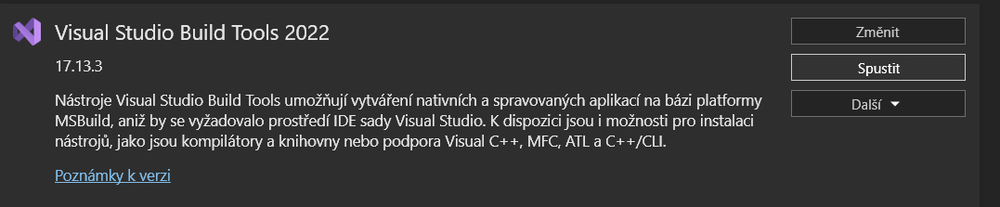
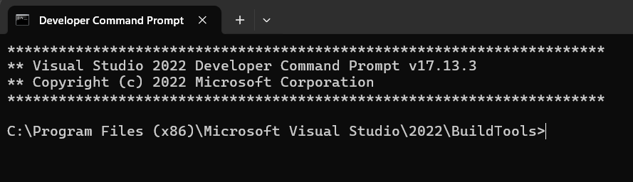

## Jak Instalovat

### Předpoklady

- C++ Build Tools / Desktop Development

> ⚠️ **Varování**: Jedná se o dlouhý instalační proces!

1. nainstalovat [Visual C++ Build Tools](https://visualstudio.microsoft.com/cs/visual-cpp-build-tools/)
    nebo terminalovym prikazem
    ```shell
    winget install Microsoft.VisualStudio.2022.BuildTools --force --override "--passive --wait --add Microsoft.VisualStudio.Workload.VCTools;includeRecommended"
    ```
    restart PC

2. [CMake Tool](https://github.com/Kitware/CMake/releases/download/v4.0.0-rc4/cmake-4.0.0-rc4-windows-x86_64.msi)
    - Během instalace zaškrtněte "Add CMake to PATH"

### Nastavení Projektu

1. Klonování repozitáře:
```shell
git clone https://github.com/Mirjax2000/Attendance_system.git
```

2. Nastavení virtuálního prostředí:
```shell
pip install uv
uv venv
.venv\Scripts\activate
```
nastavit python interpreter
spustit visual studio instaler


kliknout na spustit

prikazem CD se dostat do rootu projectu

spustit sadu prikazu
```shell
pip install uv
uv add dlib
```
pokud zde vsechno projde muze se instalovat seznam modulu prikazem
```shell
uv sync
```


## TAJNÝ KLÍČ
1. Vytvořte soubor `.env` přejmenováním `.env.example` a přidejte proměnnou SECRET_KEY
2. Zkopírujte hodnotu z Django attendance `settings.py` (bez uvozovek)
3. Aktualizujte nastavení pomocí:
```python
load_dotenv(override=True)
SECRET_KEY = os.getenv("SECRET_KEY", default="")
```

4. V případě potřeby vygenerujte nový SECRET_KEY:
```shell
python -c "from django.core.management.utils import get_random_secret_key; print(get_random_secret_key())"
```
5. Použijte FERNET klíč z `.env.example`

## Příkazy Projektu
Spuštění projektu:
```shell
django-admin startproject <název_projektu> .
python manage.py startapp <název_aplikace>
```

Databázové migrace:
```shell
python manage.py makemigrations
python manage.py migrate
```
Registrujte aplikaci v nastavení

Vytvoření superuživatele (pouze při počátečním nastavení):
```shell
python manage.py createsuperuser
```

### Struktura Projektu
- BASE_DIR
     - soubory -> fixtures.json, assets atd.
     - projekt
     - vaše_aplikace
          - templates -> šablony aplikace
          - static -> statické soubory aplikace
     - templates - globální šablony
         - base.html
         - 404.html
     - static -> globální statické soubory
          - main.css

## Operace s Databází
```shell
python manage.py dumpdatautf8 myapp --indent 2 > fixtures.json
python manage.py loaddatautf8 .\files\fixtures.json
```

## Render to String
Pro HttpResponseNotFound přidejte do views:
```python
from django.template.loader import render_to_string

def custom_404(request, exception):
     html = render_to_string("404.html", {"message": str(exception)})
     return HttpResponseNotFound(html)
```

Přidejte do urls.py:
```python
from moje_aplikace.views import custom_404

handler400 = "moje_aplikace.views.custom_400"
handler403 = "moje_aplikace.views.custom_403"
handler404 = "moje_aplikace.views.custom_404"
handler500 = "moje_aplikace.views.custom_500"
```

## Reference Polí Modelu
```python
created = models.DateTimeField(auto_now_add=True)
updated = models.DateTimeField(auto_now=True)
```

## Nastavení Admin Panelu
V admin.py:
```python
from . import models

admin.site.register(models.Movie)
```
